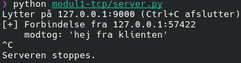
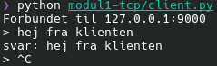
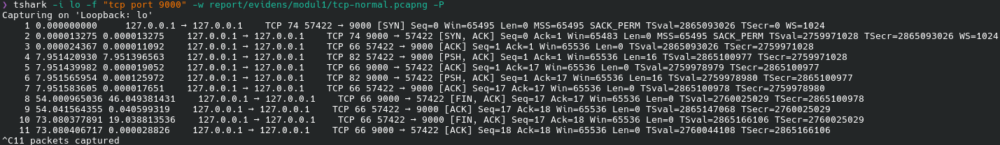
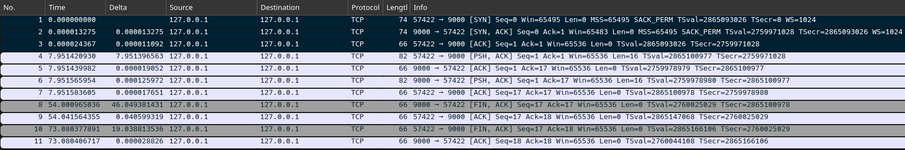
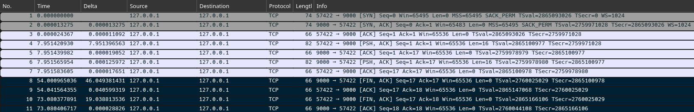
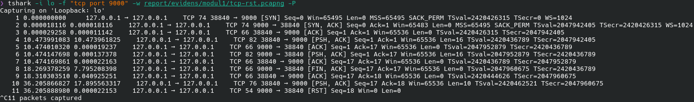
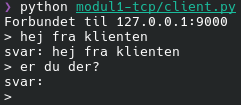
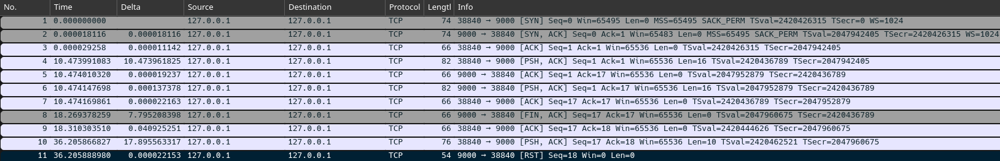
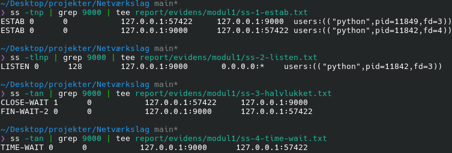

# Modul 1: TCP, transportlaget

## Formål

At forstå, hvordan pålidelig, forbindelsesorienteret kommunikation fungerer under HTTP, ved selv at
bygge en simpel TCP-klient og -server og observere forbindelsen i Wireshark.

## Sikkerhedsmæssig relevans

- Firewalls og IDS/IPS-systemer træffer beslutninger på baggrund af TCP's forbindelsestilstand. At
  forstå handshake og state er en forudsætning for at kunne læse deres logs.
- Angreb som SYN-flood udnytter forbindelsesopbygningen direkte (serveren skal holde tilstand for
  halvåbne forbindelser), og kan kun genkendes, hvis man ved, hvordan en normal handshake ser ud.
- Værktøjer som `netstat` og `ss` giver kun mening, hvis man forstår de underliggende
  forbindelsestilstande (`LISTEN`, `ESTAB`, `TIME-WAIT`).
- At binde en tjeneste til loopback frem for "alle interfaces" er en grundlæggende
  sikkerhedsvane: mindst mulig eksponering er billigere at forsvare end at rydde op efter en
  tjeneste, der var tilgængelig for flere end tiltænkt.

## Design

Serveren og klienten er skrevet med Pythons indbyggede `socket`-modul, uden højniveaubiblioteker.
Koden ligger i [`modul1-tcp/`](https://github.com/LOLCATATONIA/network-layers/tree/main/modul1-tcp).

| Valg | Begrundelse |
|---|---|
| `HOST = "127.0.0.1"` | Serveren lytter kun på loopback. `0.0.0.0` ville betyde "alle netværksinterfaces" og eksponere tjenesten for andre maskiner. |
| `PORT = 9000` | 8080 er reserveret til HTTP-serveren i modul 3. |
| `SO_REUSEADDR` | Uden den fejler en hurtig genstart af serveren med "Address already in use", mens den gamle forbindelse står i `TIME_WAIT`. |
| `if not data: break` | `recv()` returnerer tom bytes (`b''`), når klienten har lukket sin side af forbindelsen (sendt FIN). Det er serverens signal til at lukke. |
| `with`-blokke | Sockets lukkes altid, også hvis noget fejler undervejs. |
| `encode()` / `decode()` | Sockets sender og modtager bytes, ikke tekststrenge. |

Serveren kalder `socket()`, `bind()`, `listen()` og derefter `accept()` i en løkke. `accept()`
blokerer, indtil en klient forbinder, og returnerer et nyt socket til netop den forbindelse.
Klienten kalder `socket()` og `connect()`. Det er `connect()`, der udløser TCP's three-way
handshake.

## Forklaring af felterne i en TCP-pakke

Wireshark og `tshark` viser hver pakke på en linje med en række felter og indstillinger. Nedenfor
en kort forklaring af dem, der optræder i captures i dette modul.

### Flag

| Flag | Betydning |
|---|---|
| `SYN` | *Synchronize*: starter en forbindelse og synkroniserer sekvensnumre. |
| `ACK` | *Acknowledge*: bekræfter modtagelse. Sat på næsten alle pakker efter den første. |
| `PSH` | *Push*: afsenderen beder modtageren aflevere dataene til programmet med det samme, uden at vente på mere. |
| `FIN` | *Finish*: afsenderen har ikke mere at sende og lukker sin side af forbindelsen. |
| `RST` | *Reset*: afbryder forbindelsen brat, fx hvis en pakke rammer en lukket port. |

### Numre og størrelser

| Felt | Betydning |
|---|---|
| `Seq` | Sekvensnummer: nummeret på pakkens første byte i afsenderens datastrøm. Wireshark viser som standard *relative* numre, så de starter ved 0. SYN og FIN tæller hver som ét nummer. |
| `Ack` | Bekræftelsesnummer: det næste sekvensnummer, modtageren forventer. `Ack=20` betyder "jeg har modtaget alt til og med byte 19". |
| `Len` | Antal bytes data i pakken (uden TCP-headeren). `Len=0` er en ren kontrolpakke. |
| `Win` | *Window*: hvor mange bytes modtageren aktuelt har plads til at modtage, før afsenderen skal vente på en bekræftelse. Styrer hastigheden (flowkontrol). |

### Indstillinger (options) aftalt i SYN-pakkerne

Disse indstillinger sendes kun i de to første pakker i handshaken (SYN og SYN, ACK), hvor de to
parter aftaler, hvad de begge understøtter.

| Indstilling | Betydning |
|---|---|
| `MSS` | *Maximum Segment Size*: den største mængde data (payload) i én pakke, som afsenderen af indstillingen vil modtage. Afledt af interfacets MTU minus IP- og TCP-header. På loopback er MTU'en 65536, så MSS er ca. 65495. På almindeligt Ethernet (MTU 1500) er den typisk 1460. |
| `WS` | *Window Scale*: `Win`-feltet er kun 16 bit og kan dermed højst angive 65535 bytes. `WS` er en multiplikator (her 1024, altså 2¹⁰), som parterne bruger til at skalere `Win` op, så vinduet kan blive langt større. Aftales kun i SYN-pakkerne. |
| `SACK_PERM` | *Selective Acknowledgment permitted*: parten kan modtage og sende selektive bekræftelser. Uden SACK kan modtageren kun sige "jeg har alt til byte X"; med SACK kan den også sige "jeg mangler kun bytes X-Y, men har resten", så afsenderen ikke gensender data, der allerede er kommet frem. |
| `TSval` | *Timestamp value*: afsenderens tidsstempel (et tal fra et internt ur) på pakken. |
| `TSecr` | *Timestamp echo reply*: ekko af det seneste `TSval`, afsenderen har modtaget fra modparten. I den allerførste SYN-pakke er det 0, fordi der endnu intet er at ekkoe. Forskellen mellem tid og ekko bruges til at måle rundturstiden (RTT), og tidsstemplerne beskytter mod gamle, forsinkede pakker, der ellers kunne forveksles med nye. |

En lille observation fra en capture, hvor handshaken ikke blev fanget: Wireshark viste da `Win=64`
i stedet for `Win=65536`. Årsagen er, at vinduesskaleringen (`WS=1024`) kun aftales i SYN-pakkerne.
Uden dem kender Wireshark ikke faktoren, og viser den uskalerede værdi (64 × 1024 = 65536).

### Sikkerhedsvinkel

Kombinationen af indstillinger i SYN-pakken (MSS, WS, SACK_PERM, tidsstempler og deres
rækkefølge) varierer mellem operativsystemer. Værktøjer til *OS fingerprinting* (fx `nmap` og
`p0f`) bruger det til at gætte, hvilket system der sidder i den anden ende. Tidsstemplerne kan
desuden afsløre, hvor længe en maskine har været tændt, da uret typisk tæller fra opstart.

## Bevis

Forløbet er fanget to gange på loopback-interfacet `lo`, i to separate kørsler af serveren og
klienten (derfor har klienten forskellige portnumre i de to kørsler): en kørsel med normal
lukning og en kørsel, hvor der opstår en `RST`. Begge captures er optaget med et
**capture-filter**, så filerne kun indeholder trafik på port 9000:

```bash
tshark -i lo -f "tcp port 9000" -w report/evidens/modul1/tcp-normal.pcapng -P
```

Capturefilerne og tekstoutputtet ligger i
[`report/evidens/modul1/`](https://github.com/LOLCATATONIA/network-layers/tree/main/report/evidens/modul1).

### Server og klient (opgave 1)

Serveren lytter på `127.0.0.1:9000`, accepterer klienten og ekkoer beskeden tilbage. Klienten er
afsluttet med Ctrl+C, som koden fanger og håndterer ved at lukke forbindelsen ordentligt. Det
sender en normal `FIN` og er altså ikke et nedbrud.





### Handshake (opgave 2)

De første tre pakker i capturen er TCP's three-way handshake:

| # | Retning | Flag | Seq / Ack | Betydning |
|---|---|---|---|---|
| 1 | klient → server (`57422 → 9000`) | `SYN` | `Seq=0` | Klienten beder om en forbindelse og foreslår sine indstillinger (MSS, WS, SACK_PERM, tidsstempler). |
| 2 | server → klient (`9000 → 57422`) | `SYN, ACK` | `Seq=0 Ack=1` | Serveren accepterer, bekræfter klientens SYN (`Ack=1`) og sender sine egne indstillinger. |
| 3 | klient → server | `ACK` | `Seq=1 Ack=1` | Klienten bekræfter serverens SYN. Forbindelsen er etableret. |

Vinduesstørrelsen (`Win`) er `65495` i SYN-pakken og `65536` i den afsluttende ACK. Forskellen
skyldes, at `WS=1024` først træder i kraft, efter SYN-pakkerne er udvekslet (se afsnittet om
indstillinger ovenfor).





### Dataudveksling

Pakke 4-7 er selve echo-udvekslingen. Beskeden `hej fra klienten` er 16 bytes:

| # | Retning | Flag | Len | Betydning |
|---|---|---|---|---|
| 4 | klient → server | `PSH, ACK` | 16 | Klienten sender beskeden. |
| 5 | server → klient | `ACK` | 0 | Serveren bekræfter modtagelsen (`Ack=17`, altså 16 bytes efter `Seq=1`). |
| 6 | server → klient | `PSH, ACK` | 16 | Serveren sender ekkoet. |
| 7 | klient → server | `ACK` | 0 | Klienten bekræfter ekkoet. |

Pausen på cirka otte sekunder mellem pakke 3 og 4 er den tid, det tog at skrive beskeden. TCP
bekræfter hver modtaget datamængde med et `ACK`, og det er denne bekræftelse, der gør TCP
pålideligt.

### Afslutning med `FIN` (opgave 2)

I denne kørsel blev **serveren lukket først** (Ctrl+C, mens klienten stadig var åben). Derfor
sender serveren den første `FIN`:

| # | Retning | Flag | Seq / Ack | Betydning |
|---|---|---|---|---|
| 8 | server → klient | `FIN, ACK` | `Seq=17 Ack=17` | Serveren har ikke mere at sende og lukker sin side. |
| 9 | klient → server | `ACK` | `Seq=17 Ack=18` | Klienten bekræfter. `Ack=18`, fordi en `FIN` tæller som ét sekvensnummer. |
| 10 | klient → server | `FIN, ACK` | `Seq=17 Ack=18` | Cirka 19 sekunder senere lukker klienten (Ctrl+C) sin side. |
| 11 | server → klient | `ACK` | `Seq=18 Ack=18` | Serveren bekræfter. Forbindelsen er helt lukket. |

Afslutningen er altså fire pakker (`FIN`, `ACK`, `FIN`, `ACK`), fordi hver retning lukkes for sig.
Mellem pakke 9 og 10 er forbindelsen **halvt lukket**: serveren er færdig med at sende, men
klienten kan i princippet stadig sende. Bekræftelsen i pakke 9 kommer cirka 40 ms efter FIN'en,
hvilket ligner Linux' forsinkede bekræftelser (*delayed ACK*), hvor modtageren venter kort for at
se, om den selv har noget at sende med.



### Afslutning med `RST`

I den anden kørsel blev serveren igen lukket først, men denne gang skrev jeg en ny besked i den
stadig åbne klient (`er du der?`):

| # | Retning | Flag | Len | Betydning |
|---|---|---|---|---|
| 8 | server → klient | `FIN, ACK` | 0 | Serveren lukker sin side. |
| 9 | klient → server | `ACK` | 0 | Klienten bekræfter. |
| 10 | klient → server | `PSH, ACK` | 10 | Klienten sender data ind i en forbindelse, serveren har lukket. |
| 11 | server → klient | **`RST`** | 0 | Serveren afviser og afbryder forbindelsen. `Seq=18 Win=0`. |

Forskellen på de to måder at slutte på er, at `FIN` er en *høflig* lukning, hvor begge sider
aftaler det, mens `RST` er en *brat afbrydelse*. Her opstår den, fordi serveren har kaldt
`close()` og ikke længere kan aflevere data til noget program. Data, der ankommer efter
`close()`, besvares derfor med `RST`. Pakken har intet `ACK`-flag, og dens `Seq=18` svarer til det
`Ack`-nummer, klienten sidst sendte. Klienten viser en tom `svar:`, fordi `recv()` returnerer tom
bytes, når den anden side har lukket (den modtog serverens `FIN` i pakke 8), og ikke en fejl.







### Forbindelsestilstande med `ss` (opgave 4)

Kommandoerne er kørt i en tredje terminal under den normale kørsel (samme forbindelse som i
capturen ovenfor, klientport `57422`), og outputtet er gemt med `tee`.

`ss` (*socket statistics*) viser maskinens sockets. Flagene bestemmer, hvilke der vises, og hvordan:

| Flag | Betydning |
|---|---|
| `-t` | Kun TCP-sockets. |
| `-n` | Numerisk visning: portnumre og adresser vises som tal (`9000`) i stedet for at blive slået op som navne. Det er hurtigere og viser præcis det, der står i pakkerne. |
| `-p` | Viser, hvilken proces (navn, pid og fildeskriptor) der ejer socket'en. Kræver, at man ejer processen eller er root. |
| `-l` | Kun **lyttende** sockets (*listening*), altså servere, der venter på forbindelser. |
| `-a` | **Alle** sockets, både lyttende og forbundne, uanset tilstand. |

Uden `-l` og `-a` viser `ss` kun forbundne sockets. Derfor bruges tre kombinationer:

| Kommando | Viser | Bruges til |
|---|---|---|
| `ss -tnp` | Forbundne TCP-sockets, numerisk, med proces. | At se de to ender af en aktiv forbindelse (`ESTAB`) og hvilke processer der ejer dem. |
| `ss -tlnp` | Kun lyttende TCP-sockets, numerisk, med proces. | At se, hvilken adresse og port serveren lytter på (`LISTEN`). |
| `ss -tan` | Alle TCP-sockets, numerisk, uden proces. | At følge en forbindelses tilstande under lukningen (`FIN-WAIT-2`, `CLOSE-WAIT`, `TIME-WAIT`). Processen vises ikke, fordi en lukket forbindelse ofte ikke længere har en ejer. |

`| grep 9000` filtrerer outputtet, så kun linjer med port 9000 vises, og `| tee fil` viser outputtet
og gemmer det samtidig i en fil.

**1. Forbindelsen er åben** (efter pakke 7):

```
$ ss -tnp | grep 9000
ESTAB 0 0 127.0.0.1:57422 127.0.0.1:9000  users:(("python",pid=11849,fd=3))
ESTAB 0 0 127.0.0.1:9000  127.0.0.1:57422 users:(("python",pid=11842,fd=4))
```

Der er to linjer, en for hver ende af den samme forbindelse: klientens (`57422 → 9000`) og
serverens (`9000 → 57422`). `-p` viser, at de tilhører to forskellige processer.

**2. Serverens lyttende socket:**

```
$ ss -tlnp | grep 9000
LISTEN 0 128 127.0.0.1:9000 0.0.0.0:* users:(("python",pid=11842,fd=3))
```

Lytteadressen er `127.0.0.1` og ikke `0.0.0.0`. Det er beviset for, at serveren kun er
tilgængelig fra maskinen selv.

**3. Serveren er lukket, klienten er stadig åben** (efter pakke 9):

```
$ ss -tan | grep 9000
CLOSE-WAIT 1 0 127.0.0.1:57422 127.0.0.1:9000
FIN-WAIT-2 0 0 127.0.0.1:9000  127.0.0.1:57422
```

**4. Begge sider er lukket** (efter pakke 11):

```
$ ss -tan | grep 9000
TIME-WAIT 0 0 127.0.0.1:9000 127.0.0.1:57422
```



| Tilstand | Betydning | Set efter |
|---|---|---|
| `LISTEN` | Serveren venter på forbindelser. | Serveren er startet |
| `ESTAB` | Forbindelsen er etableret, data kan sendes. | Pakke 3 (handshake færdig) |
| `FIN-WAIT-2` | Serveren har sendt `FIN` og fået den bekræftet. Den venter på, at klienten også lukker. | Pakke 9 |
| `CLOSE-WAIT` | Klienten har modtaget serverens `FIN`, men har endnu ikke selv lukket. `Recv-Q 1` skyldes formentlig den modtagne `FIN`, som klienten endnu ikke har læst. | Pakke 9 |
| `TIME-WAIT` | Den side, der lukkede *først* (her serveren), holder forbindelsen i live i et stykke tid efter afslutningen (på Linux 60 sekunder), så sene pakker fra den gamle forbindelse ikke forveksles med en ny. | Pakke 11 |

Bemærk, at `TIME-WAIT` opstår hos den, der lukker først. Her var det serveren, og det er samme
mekanisme, der gør `SO_REUSEADDR` nødvendig i `server.py`.

## TCP vs. UDP (opgave 3)

| Egenskab | TCP | UDP |
|---|---|---|
| Forbindelse | Forbindelsesorienteret: handshake før data (pakke 1-3 ovenfor). | Forbindelsesløs: pakker sendes uden forudgående opsætning. |
| Pålidelighed | Alt bekræftes med `ACK`. Tabte pakker gensendes. | Ingen garantier: pakker kan gå tabt eller komme dobbelt. |
| Rækkefølge | Data leveres i den rækkefølge, de blev sendt. | Ingen garanti for rækkefølgen. |
| Overhead | Højere (handshake, bekræftelser, tilstand hos begge parter). | Lav. |
| Typiske brugsområder | Web, e-mail, SSH, filoverførsel. | DNS-opslag, streaming, spil, VoIP. |

**Hvorfor er HTTP bygget oven på TCP?** En webside, der kommer halvt eller i forkert rækkefølge,
er ubrugelig. HTTP har brug for, at alle bytes ankommer, hele og i orden, og det sørger TCP for
(bekræftelser, gensendelse og rækkefølge). Med UDP skulle hvert program selv genopfinde det.

Modeksemplet er DNS (modul 2): et opslag er en lille forespørgsel og et lille svar, så en
handshake ville koste mere end selve opslaget. Går svaret tabt, spørger klienten bare igen. Derfor
bruger DNS som udgangspunkt UDP.

## Delkonklusion

Modulet viser, at TCP's forbindelsesopbygning og -afslutning er synlig og målbar, og at
forbindelsestilstandene i `ss` kan følges pakke for pakke i Wireshark: `ESTAB` efter handshaken,
`FIN-WAIT-2`/`CLOSE-WAIT` efter den første `FIN`, og `TIME-WAIT` hos den, der lukkede først.
Det overraskede mig, at en almindelig lukning tager fire pakker, og at forbindelsen kan være
halvt lukket i et stykke tid. Det er også tydeligt, at en `RST` opstår helt naturligt, når en
klient skriver til en forbindelse, den anden side allerede har lukket, og at en `RST` derfor
ikke i sig selv er tegn på et angreb.

Med hensyn til sikkerhed peger modulet på to ting. For det første er `TIME-WAIT` hos serveren en
konsekvens af, at serveren lukker først. En tjeneste, der lukker mange forbindelser, kommer til
at holde mange sockets i den tilstand. For det andet afhænger både firewalls og angreb som
SYN-flood af den handshake og de tilstande, der her er observeret. At serveren bindes til
`127.0.0.1` og ikke `0.0.0.0` er en billig måde at reducere eksponeringen på fra start.

En forbedring, jeg ikke har lavet, er at få `client.py` til at skrive "serveren har lukket
forbindelsen", når `recv()` returnerer tom bytes. Nu ser en lukket forbindelse ud som en tom
`svar:`, hvilket er let at misforstå.
