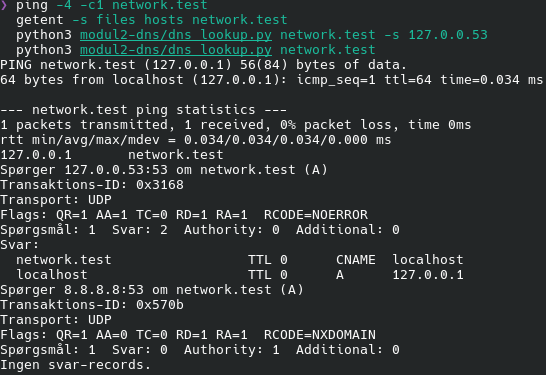
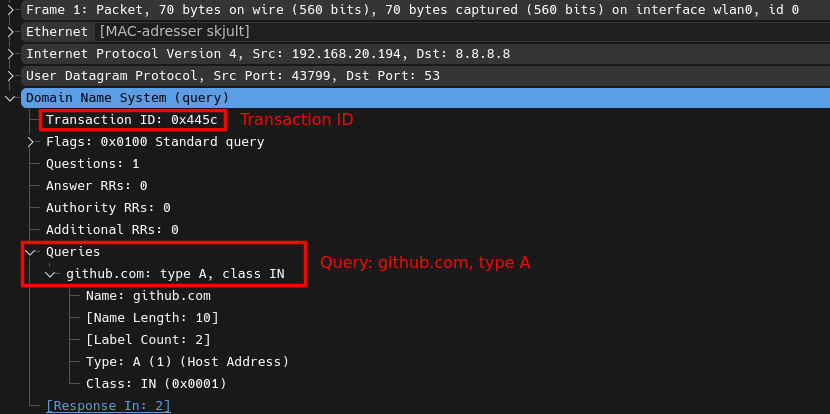
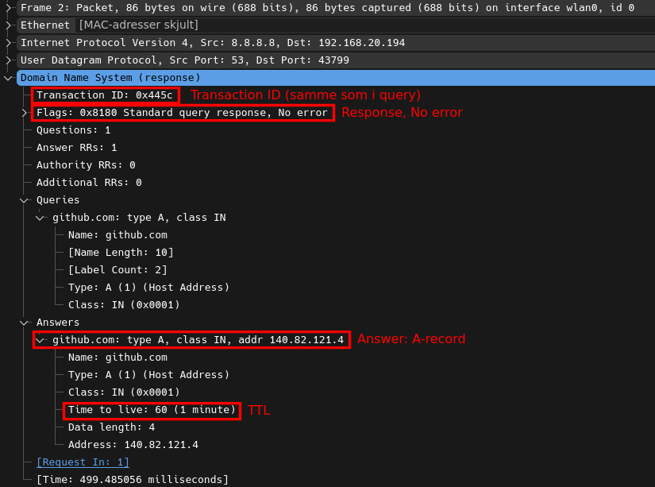

# Modul 2: DNS, fra navn til adresse

## Formål

At forstå og selv kunne udføre navneopløsning ved at bygge en DNS-forespørgsel som rå bytes,
sende den over UDP og læse svaret. Desuden at konfigurere lokal navneopløsning til et selvvalgt
domænenavn.

## Sikkerhedsmæssig relevans

- DNS er ofte usikret og et hyppigt mål for spoofing og cache poisoning, fordi mange systemer
  stoler blindt på svaret uden yderligere verifikation.
- DNS bruges aktivt af angribere til data-eksfiltrering og command-and-control-kommunikation
  (DNS tunneling), netop fordi DNS-trafik sjældent inspiceres nøje.
- DNS er det første skridt i næsten enhver netværksforbindelse. En forkert eller kompromitteret
  DNS-opsætning kan omdirigere brugere til ondsindede systemer, uden at de mærker noget.

## Design

Scriptet [`modul2-dns/dns_lookup.py`](https://github.com/LOLCATATONIA/network-layers/blob/main/modul2-dns/dns_lookup.py)
bygger selv forespørgslen og læser svaret med Pythons `socket`- og `struct`-moduler. Der bruges
ingen DNS-biblioteker.

| Valg | Begrundelse |
|---|---|
| UDP (`SOCK_DGRAM`) på port 53 | DNS-opslag er små og består af én forespørgsel og ét svar, så en TCP-handshake ville koste mere end selve opslaget. Går et svar tabt, spørger klienten bare igen. |
| Transaktions-ID valgt tilfældigt (2 byte) | Bruges til at genkende vores eget svar. |
| Kun flaget `RD` (*recursion desired*) sat | Vi beder resolveren om selv at finde svaret. |
| `struct.pack("!HHHHHH", …)` | `!` er netværks-byterækkefølge (big-endian), `H` er 2 byte. |
| Svar accepteres kun fra den resolver, vi spurgte, med det ID, vi sendte | UDP har ingen forbindelse, så hvem som helst kan sende en pakke til socket'en. Ellers kunne et forfalsket svar overtage. |
| Pointer-komprimering understøttes, med en grænse for antal hop | Se nedenfor. Grænsen forhindrer, at en ødelagt eller ondsindet pakke sender scriptet i en uendelig løkke. |
| Længder og grænser kontrolleres ved parsing | En afkortet eller misdannet pakke giver en fejlmeddelelse i stedet for et nedbrud. |
| Automatisk skift til TCP ved `TC=1` | Se afsnittet om `TXT`. |

Scriptet understøtter recordtyperne `A`, `AAAA`, `NS`, `CNAME`, `MX`, `TXT` og `SOA`.

## Hvordan en DNS-pakke er bygget

En DNS-pakke består af en **header** på 12 byte efterfulgt af **sektioner**. Forespørgslen er
header og spørgsmål. Svaret gentager spørgsmålet og tilføjer svar-records.

**Header (12 byte):**

| Felt | Størrelse | Betydning |
|---|---|---|
| Transaktions-ID | 2 byte | Parrer svar med forespørgsel. |
| Flags | 2 byte | `QR` (0 = forespørgsel, 1 = svar), `RD`, `RA`, `TC`, `AA` og `RCODE` (statuskode). |
| Antal spørgsmål | 2 byte | I vores forespørgsel: 1. |
| Antal svar | 2 byte | 0 i en forespørgsel. |
| Antal authority- og additional-records | 2 + 2 byte | 0 i en forespørgsel. |

**Spørgsmål:** domænenavnet, en type (2 byte) og en klasse (2 byte, `IN` = 1).

Domænenavnet er kodet som en række *labels*, hvor hver label har et længde-byte foran, og hele
navnet afsluttes med en nul-byte. `github.com` bliver til `06 "github" 03 "com" 00`.

**Pointer-komprimering:** navne i svaret bruger ofte en *pointer* i stedet for at gentage hele
navnet. Når de to øverste bit i et længde-byte er `11`, er de resterende 14 bit en position i
pakken, hvor navnet allerede står. Så fylder `github.com` to bytes i stedet for tolv.

## Bevis

De samlede tekstoutputs og capturen ligger i
[`report/evidens/modul2/`](https://github.com/LOLCATATONIA/network-layers/tree/main/report/evidens/modul2).

### De rå bytes i et opslag

Kørt med `-v`, som viser pakkerne som hexadecimale bytes:

```
$ python3 modul2-dns/dns_lookup.py github.com A -v
Spørger 8.8.8.8:53 om github.com (A)
Transaktions-ID: 0x072e
Forespørgsel (28 bytes): 07 2e 01 00 00 01 00 00 00 00 00 00 06 67 69 74 68 75 62 03 63 6f 6d 00 00 01 00 01
Svar (44 bytes): 07 2e 81 80 00 01 00 01 00 00 00 00 06 67 69 74 68 75 62 03 63 6f 6d 00 00 01 00 01 c0 0c 00 01 00 01 00 00 00 3c 00 04 8c 52 79 03
Transport: UDP
Flags: QR=1 AA=0 TC=0 RD=1 RA=1  RCODE=NOERROR
Spørgsmål: 1  Svar: 1  Authority: 0  Additional: 0
Svar:
  github.com                   TTL 60     A      140.82.121.3
```

**Forespørgslen (28 byte):**

| Bytes | Felt | Betydning |
|---|---|---|
| `07 2e` | Transaktions-ID | `0x072e` |
| `01 00` | Flags | Kun `RD` er sat |
| `00 01` | Spørgsmål | 1 |
| `00 00` `00 00` `00 00` | Svar, authority, additional | 0 |
| `06 67 69 74 68 75 62` | Label | længde 6, derefter `github` |
| `03 63 6f 6d` | Label | længde 3, derefter `com` |
| `00` | Nul-byte | Navnet er slut |
| `00 01` | Type | `A` |
| `00 01` | Klasse | `IN` |

**Svaret (44 byte).** De første 28 byte er et ekko af forespørgslen, med to ændringer: flags er
nu `81 80` (`QR=1`, `RD=1`, `RA=1`, ingen fejl) og antallet af svar er `00 01`. Derefter følger
selve svar-recorden på 16 byte:

| Bytes | Felt | Betydning |
|---|---|---|
| `c0 0c` | Navn | **Pointer** til position 12, hvor `github.com` står i spørgsmålet |
| `00 01` | Type | `A` |
| `00 01` | Klasse | `IN` |
| `00 00 00 3c` | TTL | `0x3c` = 60 sekunder |
| `00 04` | Længde | 4 byte data |
| `8c 52 79 03` | Adresse | 140.82.121.3 (`0x8c` = 140, `0x52` = 82, `0x79` = 121, `0x03` = 3) |

### Recordtyper (opgave 3)

Alle fem recordtyper er slået op for `github.com` mod resolveren `8.8.8.8`:

| Type | Opslag | Svar | Formål |
|---|---|---|---|
| `A` | `github.com` | `140.82.121.3` (TTL 60) | Oversætter et navn til en IPv4-adresse. Det er den, en browser bruger til at finde serveren. |
| `CNAME` | `www.github.com` | `github.com` (TTL 3591) | Et **alias**: `www` peger på et andet navn, og opslaget fortsætter dér. |
| `MX` | `github.com` | `0 github-com.mail.protection.outlook.com` (TTL 5) | Peger på domænets **mailserver**. Tallet er præferencen (lavest først). Recorden peger på et navn, ikke en IP, så afsenderen slår også dette navn op. |
| `TXT` | `github.com` | 24 records, bl.a. SPF og verificeringstekster | Frit tekstindhold. Bruges til bl.a. SPF (hvilke servere må sende mail for domænet) og til at bevise ejerskab over for tjenester. |
| `NS` | `github.com` | 8 nameservere (AWS Route 53 og NS1), TTL 2425 | Angiver, hvilke servere der er **autoritative** for domænet, altså har det endelige svar. |

Uddrag af output for de enkelte typer:

```
$ python3 modul2-dns/dns_lookup.py www.github.com CNAME
  www.github.com               TTL 3591   CNAME  github.com

$ python3 modul2-dns/dns_lookup.py github.com MX
  github.com                   TTL 5      MX     0 github-com.mail.protection.outlook.com

$ python3 modul2-dns/dns_lookup.py github.com NS
  github.com                   TTL 2425   NS     ns-1283.awsdns-32.org
  github.com                   TTL 2425   NS     dns3.p08.nsone.net
  ... (8 nameservere i alt)
```

Et opslag på `www.github.com` med type `A` returnerer **både** aliaset og adressen i samme svar:

```
  www.github.com               TTL 3598   CNAME  github.com
  github.com                   TTL 60     A      140.82.121.4
```

**Om TTL.** *Time to live* er det antal sekunder, et svar må gemmes i cache. De viste værdier er
derfor ikke faste. En resolver tæller ned, mens den har svaret gemt, så samme opslag giver
forskellige TTL'er afhængigt af, hvornår man spørger (fx `MX` med TTL 258 ved ét opslag og 5 ved et
senere). Forskellene mellem typerne er en pointe i sig selv: `A`-recorden har en kort TTL (60 s),
så adressen hurtigt kan skiftes, mens `CNAME` og `NS`, som sjældent ændres, har en langt længere.
Adressen for `github.com` varierer også (her `.3` og `.4`), fordi GitHub bruger flere adresser.

### `TXT`: UDP-svaret er for stort, og der skiftes til TCP

`github.com` har så mange `TXT`-records, at svaret ikke kan være i ét UDP-svar. Resolveren sætter
flaget `TC` (*truncated*) og sender ingen records med. Det viser scriptet, når TCP-skiftet slås fra:

```
$ python3 modul2-dns/dns_lookup.py github.com TXT --udp-only
Flags: QR=1 AA=0 TC=1 RD=1 RA=1  RCODE=NOERROR
Spørgsmål: 1  Svar: 0  Authority: 0  Additional: 0
[!] Svaret er afkortet (TC=1), og TCP-fallback er slået fra (--udp-only).
Ingen svar-records.
```

Uden `--udp-only` gentager scriptet forespørgslen over TCP, hvor der ikke er en størrelsesgrænse.
Over TCP sættes en 2-byte længde foran pakken, fordi TCP er en byte-strøm uden beskedgrænser
(samme pointe som i modul 1). Resultatet er 24 records:

```
$ python3 modul2-dns/dns_lookup.py github.com TXT
[!] Svaret er afkortet (TC=1). Gentager forespørgslen over TCP.
Transport: TCP
Svar: 24
  github.com   TTL 82   TXT   "google-site-verification=82Le34Flgtd15ojYhHlGF_6g72muSjamlMVThBOJpks"
  ...
  github.com   TTL 82   TXT   "v=spf1 ip4:192.30.252.0/22 include:spf.protection.outlook.com ...
                                include:sendgrid.net ip4:62.253.2" "27.114 ip4:166.78.69.169 ... ~all"
```

SPF-recorden er delt i to citerede strenge (`"…ip4:62.253.2" "27.114 …"`). En enkelt streng i en
`TXT`-record kan højst være 255 byte, så længere værdier deles op. Scriptet læser strengene som
længde-præfikserede blokke og viser dem samlet. Rækkefølgen af records varierer mellem opslag, da
DNS ikke garanterer en rækkefølge. Kun et uddrag er vist her, da de 24 records mest er
verificeringstokens fra tredjepartstjenester.

### Lokal navneopløsning (opgave 2)

Domænenavnet `network.test` er sat til at pege på loopback ved at tilføje en linje til
`/etc/hosts` (kræver `sudo`):

```
$ echo '127.0.0.1 network.test' | sudo tee -a /etc/hosts
127.0.0.1 network.test
```

Topdomænet `.test` er reserveret til test og findes aldrig på det rigtige internet, så navnet
kan ikke komme i konflikt med et rigtigt domæne. Screenshottet viser fire kommandoer:



| Kommando | Resultat | Betydning |
|---|---|---|
| `ping -4 -c1 network.test` | Svar fra `127.0.0.1` | Navnet løses til loopback. |
| `getent -s files hosts network.test` | `127.0.0.1 network.test` | Kun `/etc/hosts` kender navnet direkte. |
| `dns_lookup.py network.test -s 127.0.0.53` | `CNAME localhost`, `A 127.0.0.1`, `AA=1` | Den lokale resolver (`systemd-resolved`) svarer selv, ud fra hosts-filen. |
| `dns_lookup.py network.test` (mod `8.8.8.8`) | **`NXDOMAIN`** | Det offentlige DNS kender ikke navnet. |

De to sidste linjer er beviset for, at opløsningen kun findes lokalt: samme navn, to resolvere,
to forskellige svar.

To observationer om, hvordan `systemd-resolved` opfører sig:

- Flaget `AA=1` (*authoritative answer*) betyder, at resolveren besvarer opslaget selv og ikke
  spørger videre. Den læser altså `/etc/hosts` og præsenterer indholdet som DNS-svar, så et
  DNS-værktøj som `dig` og mit script kan slå navnet op. Det fungerer derfor også over UDP på
  `127.0.0.53`.
- Svaret er `network.test CNAME localhost`, ikke en direkte `A`-record. Resolveren ser ud til at
  samle poster med samme IP-adresse, så `localhost` (som står først i hosts-filen) bliver det
  egentlige navn, og `network.test` bliver et alias. En konsekvens er, at et almindeligt `ping`
  uden `-4` svarer fra `::1` (IPv6), fordi `localhost` også har en IPv6-adresse. Derfor er
  `ping -4` brugt ovenfor, så svaret kommer fra `127.0.0.1`, som opgaven forudsætter.

### DNS i Wireshark (opgave 4)

Et opslag af `github.com` mod den eksterne resolver `8.8.8.8` er fanget på `wlan0` med et
**capture-filter**, så filen kun indeholder DNS-trafik til `8.8.8.8`:

```bash
tshark -i wlan0 -f "udp port 53 and host 8.8.8.8" -w report/evidens/modul2/dns-github.pcapng -P
```

Capturen indeholder to pakker: en forespørgsel og et svar.

| # | Retning | Indhold |
|---|---|---|
| 1 | `192.168.20.194:43799 → 8.8.8.8:53` | **Query**: `github.com`, type `A`, transaktions-ID `0x445c` |
| 2 | `8.8.8.8:53 → 192.168.20.194:43799` | **Response**: `github.com → 140.82.121.4`, **TTL 60**, samme transaktions-ID `0x445c` |

Screenshottene er taget i Wireshark. Felterne er markeret med røde rammer, som er tegnet ovenpå
billederne bagefter, fordi Wireshark kun kan fremhæve ét felt ad gangen. MAC-adresserne på
Ethernet-linjen er skjult.





Transaktions-ID'et `0x445c` er ens i forespørgsel og svar, og det er det, der parrer dem. Svaret
kommer fra port 53 til den tilfældige kildeport `43799`, som operativsystemet valgte til
forespørgslen. Wireshark viser, at svaret ankom cirka 0,5 sekund efter forespørgslen.

## Sikkerhedsvinkel

- **Spoofing og cache poisoning.** UDP har ingen forbindelse, så en angriber kan forsøge at sende
  et falsk svar. Skal det accepteres, skal det ramme det rigtige transaktions-ID (kun 16 bit, altså
  65.536 muligheder) og den rigtige kildeport. Det er derfor, scriptet kun accepterer svar med
  det rigtige ID fra den resolver, det spurgte. Den tilfældige kildeport lægger endnu en
  gættebyrde ovenpå, og at en klient vælger både ID og port tilfældigt er en grundlæggende
  beskyttelse.
- **Ingen verifikation.** Selve DNS-svaret er ikke signeret. Klienten kan ikke se, om et svar er
  ægte, bare at det passer til forespørgslen. Løsninger som DNSSEC findes, men er ikke brugt her.
- **Parsing af upålidelig input.** Et DNS-svar er data fra netværket og kan være misdannet. Derfor
  kontrollerer scriptet længder og har en grænse for antal pointer-hop. En pointer, der peger
  tilbage på sig selv, ville ellers give en uendelig løkke.
- **`TXT` og tunneling.** `TXT`-records kan rumme vilkårlig tekst, og DNS-trafik inspiceres sjældent
  nøje. Det er en grund til, at DNS bruges til at smugle data ind og ud.

## Delkonklusion

Modulet viser, at DNS ikke er magi: et opslag er en lille, veldefineret binær pakke, og den kan
bygges og læses med få linjer kode. Det, jeg fandt mest læreværdigt, var **pointer-komprimeringen**
(`c0 0c`), som ikke er nævnt i mange oversigter, men som er nødvendig for at læse ethvert svar
med flere records, og at et **svar kan være afkortet** og kræve et skift fra UDP til TCP. Det
forbinder modul 1 og 2.

At læse svaret i Wireshark og i de rå bytes gjorde det tydeligt, at `TTL` er cachens levetid og
ikke en fast egenskab ved en record, og at `A`, `CNAME`, `MX`, `TXT` og `NS` har hver deres rolle.
Den lokale navneopløsning viste, at `/etc/hosts` overstyrer det offentlige DNS, og at
`systemd-resolved` gør hosts-filen synlig som rigtige DNS-svar. Det er praktisk til test, men det
er også en påmindelse om, hvor let navneopløsning kan omdirigeres på en maskine med lokale
rettigheder.

## Oprydning

Linjen `127.0.0.1 network.test` i `/etc/hosts` er en ændring af systemet uden for projektet og
skal fjernes, når opgaven er afleveret:

```bash
sudo sed -i '/network.test/d' /etc/hosts
```
